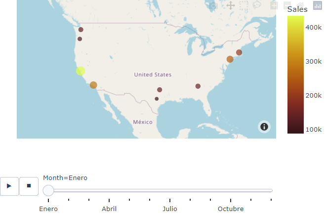

<!-- PROJECT LOGO -->
 

  <h3 align="center">BI analysis kaggle competition</h3>

  

    Business inteligent sobre la data de una cadena de tiendas.
     
     

## Introducción

El proyecto busca realizar la limpieza, procesamiento y análisis de un conjunto de datos producto de las ventas realizadas en una cadena de tiendas a lo largo de Estados Unidos, con el fin de proporcionar información relevante para la toma de decisiones.

* Resultados:

Este script hace uso de librerías y frameworks tales como pandas, seaborn, plotly, entre otros.

## Descipción

El dataset es producto de una competición de la plataforma kaggle, el cual puede ser encontrado en el siguiente link: [Competición kaggle](https://www.kaggle.com/datasets/knightbearr/sales-product-data "Competición kaggle.")

<!-- LICENSE -->
## License

  Distributed under the MIT License. See `LICENSE` for more information.

<!-- CONTACT -->
## Contact

Email: mateo.sanchezalzate@gmail.com

Portfolio: 
[Página Web](https://deimaxs.github.io/ "Página Web")

LinkedIn: 
[Mateo Sánchez](https://www.linkedin.com/in/mateo-sanchez-ds/ "Mateo Sánchez")